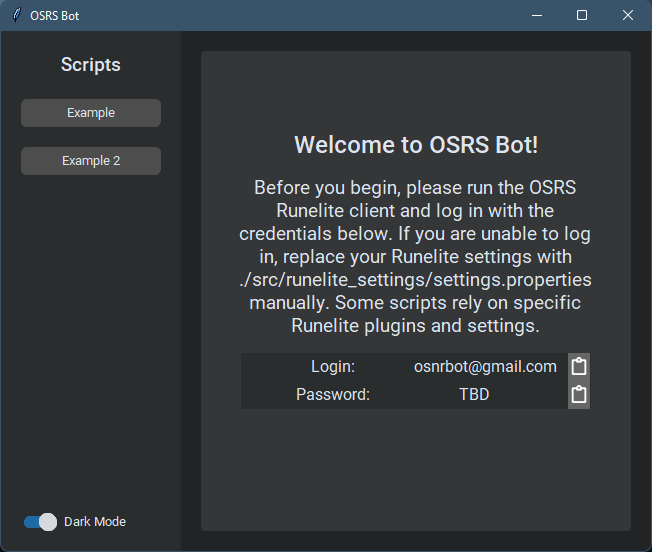
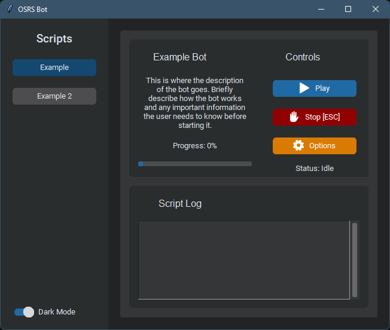
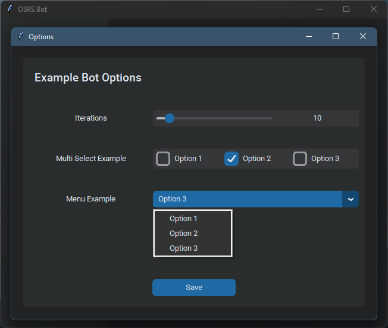
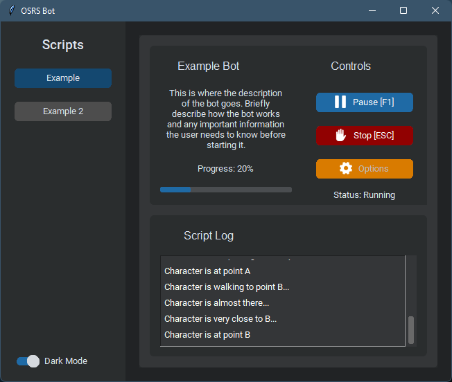

**Last updated July 18, 2022.** Some information may be inaccurate.

# osrs-bot
 A program that can execute a variety of automation tools for Old School RS.
 This project is a work in progress and is not yet complete.

# Project Setup
1. Clone/download the repository.
2. Open the repository folder in a terminal window.
   1. Create a virtual environment. ```python -m venv env```
   2. Activate the newly created virtual environment. ```.\env\Scripts\activate```
   3. Install the depedencies. ```pip install -r requirements.txt```
3. Open the project folder in your IDE (VS Code preferred).
4. Run main.py (./src/main.py)

# Project Overview
Upon running the program, the user will be met with a startup screen that should tell them how to configure their Runelite client. It is essential that Runelite settings are configured correctly, as much of the bot-utility library relies on various Runelite plugins. One way of ensuring uniformity in Runelite settings is to encourage the user to log in with an account that already has the correct settings. A better way would be to create a function that swaps the user's settings with the settings.properties file in the project, but this has not been implemented yet.



The user can select a script on the left-side menu. This will change the right-side pane to display the script's control panel, and script log. [This UI view](src/view/bot_view.py) is pre-written and reacts to a custom Bot model class that is passed to it (in this case, [ExampleBot class](src/model/example_bot.py)). This means that developers need only define their Bot's name, description, properties and logic, and the rest is taken care of. The functionality of the buttons are also pre-configured to work with Bot models that extend the [Bot class](src/model/bot.py).



Before a script can run, the user must configure its options. Clicking the "Options" button will open a new window to accept user input. This prevents users from having to edit source code when adjusting script behaviour. This is the **only** view that needs to be created by the developer. An example can be found [here](src/view/bot_options/example_bot_options.py).



Clicking "Play" will run the script. It will run the Bot instance's main_loop() function on a separate thread, so the user can continue to interact with the program. All scripts are pre-configured to listen for keyboard interrupts, so the user can pause/stop the script at any time while their mouse is compromised by the bot. Script progress is updated in the script log and progress bar throughout execution.



# Instructions for adding new bots
Much of the boilerplate code is already in place. You just need to add and modify a few files to create a new bot. **Before jumping the gun, make sure you have a good understanding of the codebase and have finished reading this guide**.

## Building the UI
Much of the UI code is already written for you. However, since each bot is different, they may require unique views and logic. To add a new bot to the client, you'll need to do the following:

- Add a new button to the left panel in [main.py](src/main.py).
- Add a new [BotView](src/views/bot_view.py) to the right panel in [main.py](src/main.py).
- Create a reference to your custom bot model in [src/model/](src/model/).
- Create an instance of [BotController](src/controller/bot_controller.py) and pass it the newly created BotView and Bot Model.
- Create a new [Bot Options View](src/view/bot_options/).
- Lastly, call the setup() method on the BotView passing it the required arguments.

### Step 1: Create the button in main.py
Find the section where all the other script buttons exist and add a new button. The command of this button should call the existing *toggle_frame_by_name* function with a name matching the name of your bot. We are using "Woodcutting" in this example.

```python
self.btn_wc = customtkinter.CTkButton(master=self.frame_left,
                                      text="Woodcutting",
                                      fg_color=("gray75", "gray30"),
                                      command=lambda: self.toggle_frame_by_name("Woodcutting", self.btn_wc))
# Set row argument according to position of button in left panel
self.btn_wc.grid(row=3, column=0, pady=10, padx=20)
```

### Step 2: Create the BotView in main.py
Navigate main.py to find the section where all the other BotViews exist and add a new BotView. You should instantiate this new view as a member of the views dictionary. The key that you assign this object to should be the name of your bot. The parent argument should always be *self.frame_right*.

```python
self.views["Woodcutting"] = BotView(parent=self.frame_right)
```
**At this point, you can run the app to see the base UI and functionality that this creates. The buttons on the bot's control panel will not work at this stage.**

### Step 3: Create an instance of your bot's model in main.py
Directly below the BotView you created in main.py, create a new instance of your bot's model. For instructions on how to create a model, see the [Bot logic section](#bot-logic). If you have not yet implemented a bot model, you can use the [ExampleBot](src/model/example.py) class as a substitute. If you're just getting started, take the example route for now.

```python
self.wc_model = Woodcutting()
# Or...
self.wc_model = ExampleBot()
```

### Step 4: Create an instance of BotController in main.py
The bot controller is **entirely** prewritten. You just need to create an instance of it and pass it to the BotView you created in main.py. The controller handles interaction between the bot and the view.

```python
self.wc_controller = BotController(model=self.wc_model,
                                   view=self.views["Woodcutting"])
```

### Step 5: Create a new Options view for your bot (this section is incomplete)
This is the tricky part. Each bot needs a custom view for setting its options. For a woodcutting bot, we might want this view to allow users to select how many trees to cut down, whether or not it should drop logs or bank them, etc. To create a new options view, you'll need to do the following:

- Create a new file in the [src/view/bot_options/](src/view/bot_options/) directory.
- Create a class called *WoodcuttingBotOptions* that extends *customtkinter.CTkFrame*.
- Build a simple UI for the user to interact with.
- Create a save() function that passes the user's input to the controller in the form of a dictionary.

**See [example_bot_options.py](src/view/bot_options/example_bot_options.py) for a place to start.**

### Step 6: Call the setup() method on the BotView in main.py
To finalize the BotView UI, you must call the setup() method. This will establish the connection between the model and the view via the controller, update the name/description in the information panel, and link the Options button with your bot's options view. You may use *ExampleBotOptions* as the argument for *options_class* if you haven't implemented your own options view.

```python
self.views["Woodcutting"].setup(controller=self.wc_controller,
                                title=self.wc_model.title,
                                description=self.wc_model.description,
                                options_class=WoodcuttingBotOptions)
                                # Or...
                                # options_class=ExampleBotOptions)
```

### Here's what it should look like when you're done:
```python
# --- Buttons ---
self.btn_wc = customtkinter.CTkButton(master=self.frame_left,
                                      text="Woodcutting",
                                      fg_color=("gray75", "gray30"),
                                      command=lambda: self.toggle_frame_by_name("Woodcutting", self.btn_wc))
self.btn_wc.grid(row=?, column=0, pady=10, padx=20)
# --- Views ---
self.views = {}
self.views["Woodcutting"] = BotView(parent=self.frame_right)
self.wc_model = Woodcutting()
self.wc_controller = BotController(model=self.wc_model,
                                   view=self.views["Woodcutting"])
self.views["Woodcutting"].setup(controller=self.wc_controller,
                                title=self.wc_model.title,
                                description=self.wc_model.description)
```

If you used the example classes as substitutes, your UI should be fairly functional. Otherwise, see the next section for how to implement a custom bot model.

## Bot logic
To create a new bot model and script, begin by creating a new model file in [src/model/](src/model/). For instance, if you are making a bot for woodcutting, call it *woodcutting.py*. Create a class of matching name that extends [Bot](src/model/bot.py). The majority of the logic for controlling your bot is already implemented in the base class. You need only implement the three required functions below.

```python
from model.bot import Bot, BotStatus

class Woodcutting(Bot):
    def __init__(self):
        title = "Woodcutting"
        description = ("Some " + "description")
        super().__init__(title=title, description=description)
    
    def save_options(self, options: dict):
        '''
        For each option in the dictionary, if it is an expected option, save the value as a property of the bot.
        If any unexpected options are found, log a warning. If an option is missing, set the options_set flag to
        False. No need to set bot status.
        '''
        pass

    def main_loop(self):
        '''
        Main logic of the bot. This function is called on a separate thread.
        '''
        pass
```

The *init()* function requires you to specify a bot title and description and pass them along to the base class. You can also declare any other attributes/options you want to use in your bot (E.g., for a Woodcutting bot, you may want to have a boolean for whether or not to bank the logs). Ultimately, the properties of your bot should sync with the options provided in your options view.

The *save_options()* function expects a dictionary of options. The keys are the names of the options and the values are the values of the options. Since options are unique to bots, you must implement a way to save the options to your bot. These properties will likely be used by your main loop logic.

The *main_loop()* function is where your bot's logic will go. It will run on a separate thread.

*IMPORTANT: While implementing these functions, the developer has a short list of responsibilities to adhere to in order for the bot to behave properly. See the [ExampleBot](src/model/example_bot.py) class for a more detailed explanation of what each function should do.*

### Bot Commands
**TODO: A library will be created for the bot to use. This library will simplify commonly used tasks, such as configuring the game client's position on screen, extracting text from a specific part of the game view (e.g., getting HP/Prayer value from minimap orb), searching the player's inventory for a specific item based on an image, dropping all items in the player's inventory, etc.**

### Updating the UI throughout the bot loop
Throughout your *main_loop()* function, you should make use of functions that relay information back to the UI. For instance, when an iteration of the bot loop has finished, you should call the [increment_iter()](src/model/bot.py#increment_iter) function, which will update the progress bar on the UI as well as updating the bot's current iterations counter property. [log_msg()](src/model/bot.py#log_msg) is a function that will log a message to the UI, and should be used frequently to keep the user informed of the bot's progress.

**TODO: Add full list of built-in functions users should use.**
