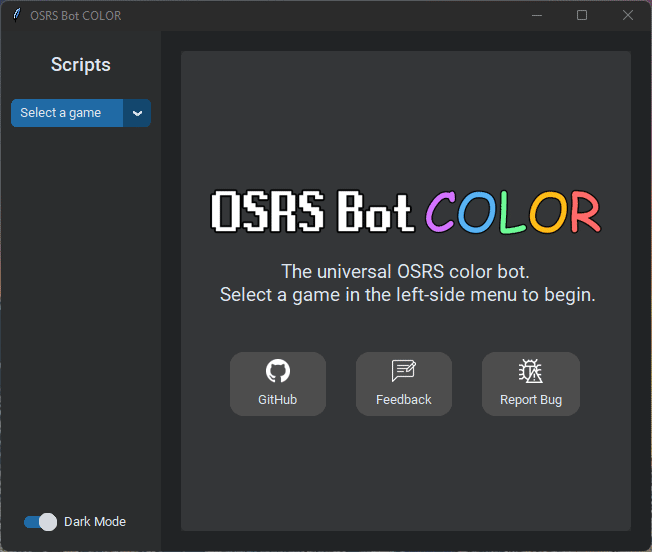
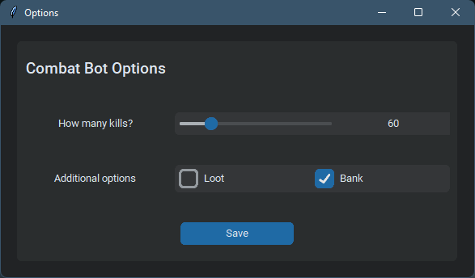
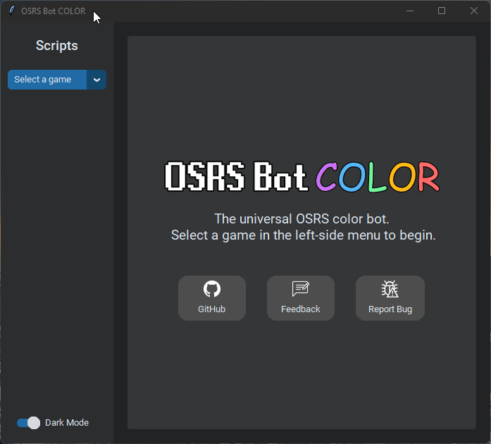
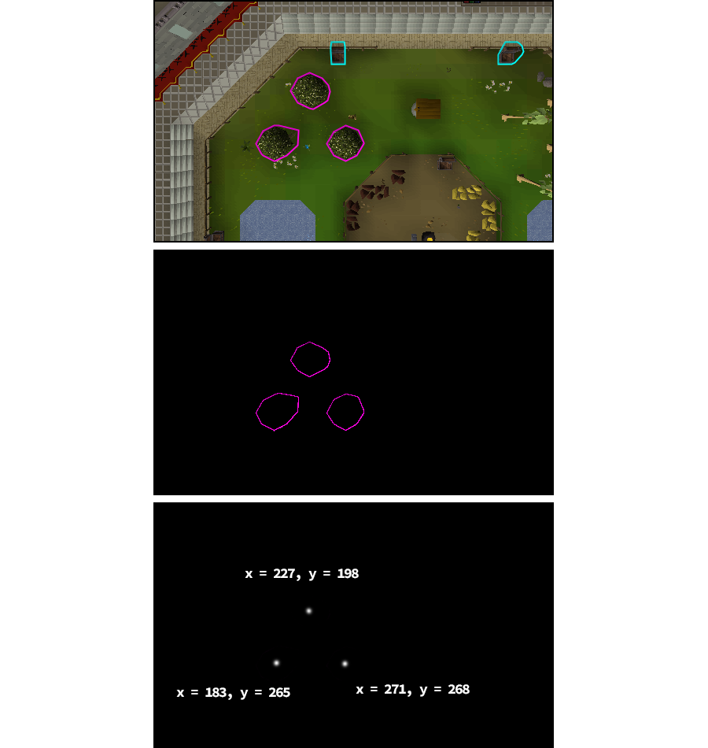

### ⚠️ This project is WIP ⚠️

# 
OSRS Bot COLOR (OSBC) is a desktop client for controlling and monitoring color-based automation scripts (bots) for OSRS and private server alternatives. This project also contains a library of tools for streamlining the development of new bots, even for inexperienced developers.

📹 [Watch the showcase on YouTube](https://www.youtube.com/watch?v=DAbyiW5mY3M)

⭐ If you like this project, consider leaving a Star

💬 [Join the Discord](https://discord.gg/Znks7Smya4)

# Table of Contents
- [Developer Setup ](#developer-setup-)
- [Features](#features)
  - [User Interface](#user-interface)
    - [Simple Option Menus](#simple-option-menus)
    - [Script Log](#script-log)
  - [Client Settings Uniformity](#client-settings-uniformity)
    - [RuneLite Settings](#runelite-settings)
    - [Automated In-Game UI Setup](#automated-in-game-ui-setup)
  - [Bot Class Architecture](#bot-class-architecture)
    - [RuneLiteBot Color Isolation Example](#runelitebot-color-isolation-example)
  - [Bot Utilities (Computer Vision, OCR, Mouse movements)](#bot-utilities-computer-vision-ocr-mouse-movements)
- [Packaging an Executable](#packaging-an-executable)
- [Support](#support)

# Developer Setup 
1. Clone/download the repository.
2. Open the repository folder in a terminal window.
   1. Create a virtual environment. ```python -m venv env```
   2. Activate the newly created virtual environment. ```.\env\Scripts\activate```
   3. Install the depedencies. ```pip install -r requirements.txt```
3. Open the project folder in your IDE (VS Code preferred).
4. Run *OSRS Bot COLOR.py* (./src/OSRS Bot COLOR.py)
   1. If you are getting an OpenCV error, try downgrading its version. ```pip install opencv-python==4.5.4.60```

To contribute code, please create feature branches off of the Development branch, and submit pull requests to it with complete features. For more developer information, see the [official documentation](https://github.com/kelltom/OSRS-Bot-COLOR/wiki). Video tutorials coming soon.

# Features
## User Interface
Gone are the days of manually running your bot scripts from an IDE. OSBC offers a clean interface for configuring, running, and monitoring your bots. For developers, this means that all you need to do is write a bot's logic loop, and *the UI is already built for you*.



### Simple Option Menus
Instead of forcing users to configure their bots via Notepad, OSBC allows developers to create option menus and parse user selections with ease.

```python
def create_options(self):
  ''' Declare what should appear when the user opens the Options menu '''
    self.options_builder.add_slider_option("kills", "How many kills?", 1, 300)
    self.options_builder.add_checkbox_option("prefs", "Additional options", ["Loot", "Bank"])

def save_options(self, options: dict):
  ''' Receive's user selections as a dictionary and saves them to the bot '''
    for option in options:
        if option == "kills":
            self.kills = options[option]
            self.log_msg(f"The bot will kill {self.kills} NPCs.")
        elif option == "prefs":
            if "Loot" in options[option]:
                self.should_loot = True
                self.log_msg("The bot will pick up loot.")
            if "Bank" in options[option]:
                self.should_bank = True
                self.log_msg("The bot will bank.")
```



### Script Log
As an alternative to the command line, OSBC's Script Log provides a clean and simple way to track your bot's progress. No more command line clutter!

```python
self.log_msg("The bot has started.")
```

## Client Settings Uniformity
Color bots rely on very specific in-game settings. Traditionally, users must manually configure their game clients so that they work with their bot scripts. This can be a hassle for those who have highly customized RuneLite settings. Luckily, OSBC offers numerous client configuration features.

### RuneLite Settings
Configuring RuneLite settings is only a few mouse clicks away. **This feature will be replaced by a toggle switch to swap between personal settings and bot settings.**



### Automated In-Game UI Setup
In a single line of code, much of the in-game UI can be automatically configured to ensure everything is where it needs to be. Color bots rely on specific pixel coordinates, so this feature ensures uniformity.

```python
self.setup()
```


## Bot Class Architecture
OSBC utilizes abstraction to simplify the development of new bots. This allows developers to focus on the logic loop and not the implementation details.


The [Bot](src/model/bot.py) class contains functionality and properties required by *all* bots. This includes the ability to start, stop, and pause the bot, log messages, update progress, and so on.

The [RuneLiteBot](src/model/runelite_bot.py) class contains botting functionality that all RuneLite-based games will have. E.g., the ability to fetch the coordinates of all tagged objects on screen.

The blue boxes represent classes for specific games. Each game needs a dedicated parent class that inherits either *Bot* or *RuneLiteBot*. Every private server is different - and although they may share the RuneLite client, that does not mean their UI elements will be in the same place as other games. These classes will have game-specific functionality. E.g., banking, loading bank presets, teleporting via custom interfaces, etc.

The orange boxes represent custom bots. If you're a developer, this is what you'd be working with. By creating a new bot class and inheriting the appropriate parent class, you'll have access to a plethora of tools that'll make your life easier.

### RuneLiteBot Color Isolation Example



## Bot Utilities (Computer Vision, OCR, Mouse movements)
**TODO: Move to Wiki**

Behind the scenes, OSBC contains a few [utility modules](src/utilities) for performing complex processing that bots rely on. This includes various computer vision techniques (color isolation, image searching, optical character recognition, etc.), as well as human-like mouse movements (still in development). These utilties are entirely de-coupled from RuneScape - the functions within them are general (E.g., screenshot a rectangle on screen, isolate a certain color in an image, get the center pixel of an enclosed contour, etc.). 

These utilties are used by the abstract bot classes to build more user-friendly functions that everyday bot-writers will understand. The goal here is to separate the complex image processing from the bot-writing process. The users/developers should not need to know how these functions work. They should only need to know how to use them.

For example, the [RuneLiteBot](src/model/RuneLite_bot.py) class might contain a function for attacking the closest NPC - *attack_nearest_NPC()*. This function performs many complex tasks: it takes a screenshot, isolates red and green to locate health bars, isolates blue contours to identify NPCs, finds the center pixel of each contour, ensures that pixel isn't a neighbour to a health bar, then clicks it. The user/developer does not need to know how this function works. They only need to know that it will attack the nearest NPC. Any function that is applicable to more than one bot should be placed in an appropriate abstract class.

# Packaging an Executable
Due to some issues with dependencies, it's not possible to build this project into a *single file* executable, however, a directory-based executable can be made.

1. In the terminal/cmd, navigate to the directory containing the project.
2. Ensure the venv is activated: ```.\env\Scripts\activate```
3. Run AutoPyToEXE via the terminal command: ```auto-py-to-exe```
   1. You may need to install it first. ```pip install auto-py-to-exe```
4. Configure the window similarly to the figure below (or import the [auto-py-to-exe_settings.json](auto-py-to-exe_settings.json) file included in the root of this repository to speed up the process).
   1. Ensure the *Additional Files* paths are correct.
   2. Under the *Icon* tab, you may point it to the [icon](documentation/media/icon.ico) file included, or use your own.
5. Click the *Convert* button.
6. Navigate to the generated *./output/OSRS Bot COLOR* folder, and within that folder you can run the *OSRS Bot COLOR.exe* file. You may move this folder to wherever you'd like.


*Note: CustomTkinter and EasyOCR need to be pointed to in the Additional Files section.

```{path to repo}/env/Lib/site-packages/customtkinter;customtkinter```

```{path to repo}/env/Lib/site-packages/easyocr;easyocr```


# Support
<p align="center">
  <a href="https://www.buymeacoffee.com/kelltom" target="_blank">
    
  </a>  
</p> 
