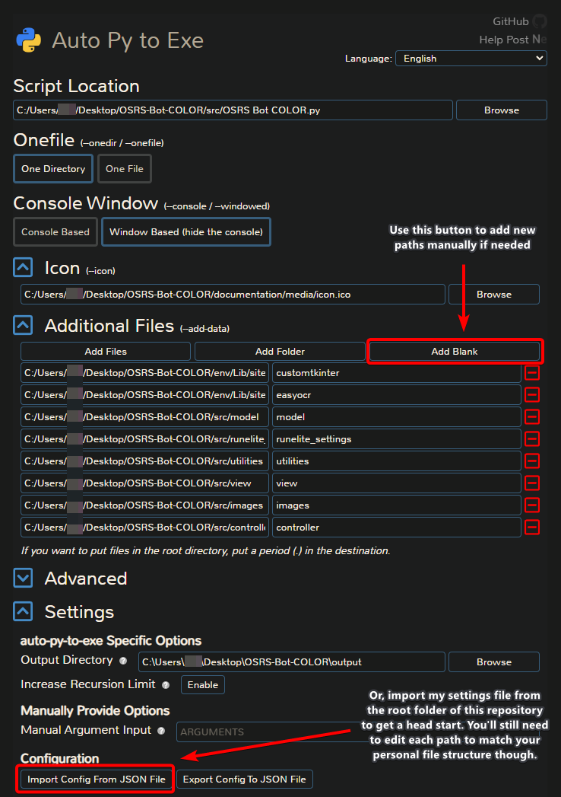

### ⚠️ This project is WIP ⚠️

# 
OSRS Bot COLOR (OSBC) is a desktop client for controlling and monitoring color-based automation scripts (bots) for OSRS and private server alternatives. This project also contains a library of tools for streamlining the development of new bots, even for inexperienced developers.

📹 Watch the [showcase](https://www.youtube.com/watch?v=DAbyiW5mY3M) or a [1-hour tutorial]() on YouTube

⭐ If you like this project, consider leaving a Star

💬 [Join the Discord](https://discord.gg/Znks7Smya4)

# Table of Contents
- [Developer Setup ](#developer-setup-)
- [Features](#features)
  - [User Interface](#user-interface)
    - [Simple Option Menus](#simple-option-menus)
    - [Script Log](#script-log)
  - [Client Settings Uniformity](#client-settings-uniformity)
    - [RuneLite Settings](#runelite-settings)
    - [Automated In-Game UI Setup](#automated-in-game-ui-setup)
  - [Bot Class Architecture](#bot-class-architecture)
    - [RuneLiteBot Color Isolation Example](#runelitebot-color-isolation-example)
  - [Bot Utilities (Computer Vision, OCR, Mouse movements)](#bot-utilities-computer-vision-ocr-mouse-movements)
- [Packaging an Executable](#packaging-an-executable)
- [Support](#support)

# Developer Setup 
1. Clone/download the repository.
2. Install Python 3.10.
3. Open the repository folder in a terminal window.
   1. Create a virtual environment. ```python -m venv env```
   2. Activate the newly created virtual environment. ```.\env\Scripts\activate```
   3. Install the depedencies. ```pip install -r requirements.txt```
4. Open the project folder in your IDE (VS Code preferred).
5. Run *OSRS Bot COLOR.py* (./src/OSRS Bot COLOR.py)

To contribute code, please create feature branches off of the _Development_ branch, and submit pull requests to it with complete features.

# Documentation

See the [Wiki](https://github.com/kelltom/OSRS-Bot-COLOR/wiki) for tutorials, and software design information.

# Features
## User Interface
Gone are the days of manually running your bot scripts from an IDE. OSBC offers a clean interface for configuring, running, and monitoring your bots. For developers, this means that all you need to do is write a bot's logic loop, and *the UI is already built for you*.


### Script Log
The Script Log provides a clean and simple way to track your bot's progress. No more command line clutter!

```python
self.log_msg("The bot has started.")
```

### Simple Option Menus
OSBC allows developers to create option menus and parse user selections with ease.

```python
def create_options(self):
  ''' Declare what should appear when the user opens the Options menu '''
    self.options_builder.add_slider_option("kills", "How many kills?", 1, 300)
    self.options_builder.add_checkbox_option("prefs", "Additional options", ["Loot", "Bank"])

def save_options(self, options: dict):
  ''' Receive's user selections as a dictionary and saves them to the bot '''
    for option in options:
        if option == "kills":
            self.kills = options[option]
            self.log_msg(f"The bot will kill {self.kills} NPCs.")
        elif option == "prefs":
            if "Loot" in options[option]:
                self.should_loot = True
                self.log_msg("The bot will pick up loot.")
            if "Bank" in options[option]:
                self.should_bank = True
                self.log_msg("The bot will bank.")
```


## Client Settings Uniformity
Color bots rely on very specific in-game settings. Traditionally, users must manually configure their game clients so that they work with their bot scripts. This can be a hassle for those who have highly customized RuneLite settings. Luckily, OSBC offers numerous client configuration features.

### RuneLite Settings
Launch a pre-configured instance of RuneLite directly from the OSBC app. This trims your client down to use minimal plugins and cleans up the bot's environment.


### Automated In-Game UI Setup
In a single line of code, much of the in-game UI can be automatically configured to ensure everything is where it needs to be. Color bots rely on specific pixel coordinates, so this feature ensures uniformity.

```python
self.setup_client()
```


## Color Isolation


# Packaging an Executable
Due to some issues with dependencies, it's not possible to build this project into a *single file* executable, however, a directory-based executable can be made.

1. In the terminal/cmd, navigate to the directory containing the project.
2. Ensure the venv is activated: ```.\env\Scripts\activate```
3. Run AutoPyToEXE via the terminal command: ```auto-py-to-exe```
   1. You may need to install it first. ```pip install auto-py-to-exe```
4. Configure the window similarly to the figure below (or import the [auto-py-to-exe_settings.json](auto-py-to-exe_settings.json) file included in the root of this repository to speed up the process).
   1. Ensure the *Additional Files* paths are correct.
   2. Under the *Icon* tab, you may point it to the [icon](documentation/media/icon.ico) file included, or use your own.
5. Click the *Convert* button.
6. Navigate to the generated *./output/OSRS Bot COLOR* folder, and within that folder you can run the *OSRS Bot COLOR.exe* file. You may move this folder to wherever you'd like.



*Note: CustomTkinter and EasyOCR need to be pointed to in the Additional Files section.

```{path to repo}/env/Lib/site-packages/customtkinter;customtkinter```

```{path to repo}/env/Lib/site-packages/easyocr;easyocr```

# Support
<p align="center">
  <a href="https://www.buymeacoffee.com/kelltom" target="_blank">
    
  </a>  
</p> 
